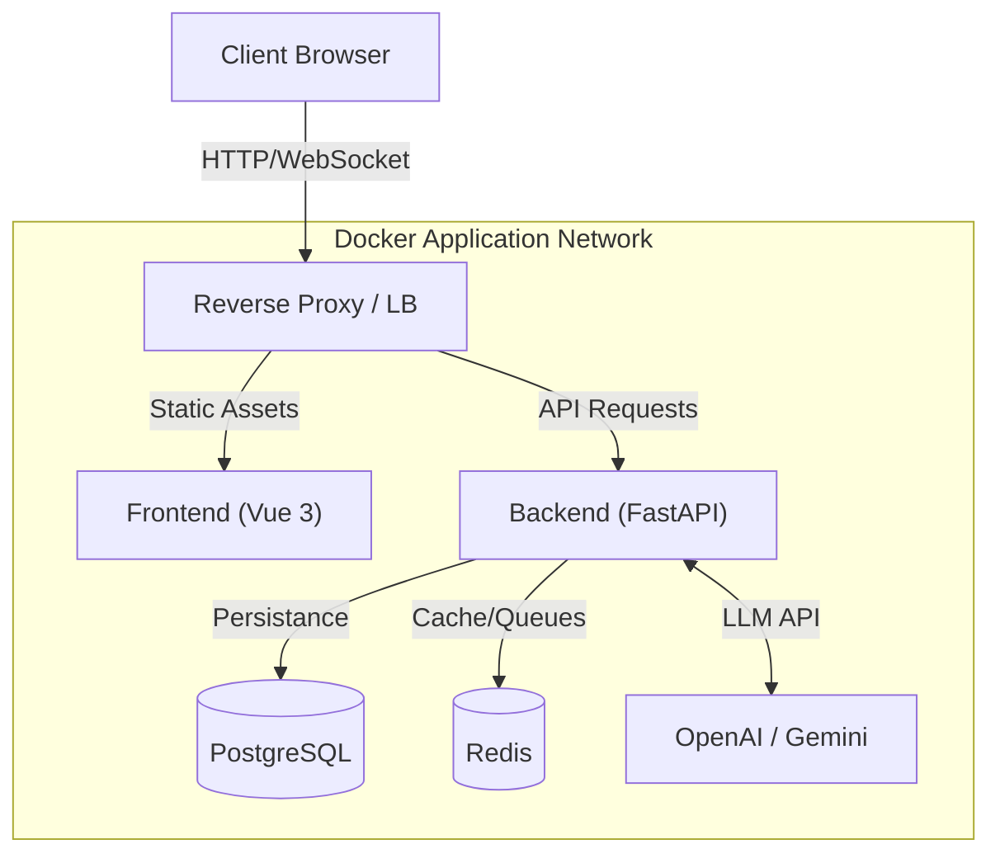

# CoAgent Studio


CoAgent Studio is a professional-grade **Multi-Agent Orchestration Platform** designed for education and complex system automation. It provides a real-time, collaborative environment where users interact with specialized AI agents (Teachers, Students, Designers, Analysts).

## 🏗️ System Architecture

The platform uses a modern, containerized microservices architecture:



## 🛠️ Technology Stack

### **Frontend** (`/frontend`)
- **Framework**: Vue 3 (Composition API) + TypeScript
- **Build**: Vite
- **Styling**: Tailwind CSS + DaisyUI
- **State**: Pinia + Composables
- **Real-time**: Native WebSockets

### **Backend** (`/backend`)
- **Framework**: FastAPI (Async Python)
- **Database ORM**: SQLModel (SQLAlchemy + Pydantic)
- **Migrations**: Alembic
- **Async Task Queue**: ARQ + Redis
- **AI Integration**: OpenAI SDK, Google GenAI
- **Security**: JWT (HttpOnly Cookies), OAuth2 Password Flow

### **Infrastructure**
- **Containerization**: Docker & Docker Compose
- **Database**: PostgreSQL 16
- **Cache**: Redis 7

## 🚀 Quick Start (Docker Composition)

The recommended way to run CoAgent Studio is via Docker Compose, which orchestrates all services (Frontend, Backend, DB, Redis).

### Prerequisites
- Docker Desktop (or Engine + Compose)
- Git

### 1. Setup Environment
Create a `.env` file in the project root:
```env
# Security
SECRET_KEY=change_this_to_a_secure_random_string
BACKEND_CORS_ORIGINS=["http://localhost:5173","http://localhost:8000"]

# Database
POSTGRES_SERVER=db
POSTGRES_USER=postgres
POSTGRES_PASSWORD=password
POSTGRES_DB=coagent_db

# External AI Providers (Optional)
OPENAI_API_KEY=sk-...
GOOGLE_API_KEY=AIza...
```

### 2. Launch
```bash
docker compose up --build -d
```
- **Frontend**: `http://localhost:5173`
- **Backend API**: `http://localhost:8000/docs`

## 💻 Manual Development

If you wish to run services individually for development:

### Backend
```bash
cd backend
python -m venv venv
source venv/bin/activate  # or venv\Scripts\activate on Windows
pip install -r requirements.txt
docker compose up db redis -d  # Run only backing services
uvicorn app.main:app --reload
```

### Frontend
```bash
cd frontend
npm install
npm run dev
```

## ✨ Key Features
- **Real-Time Collaboration**: WebSocket-based chat rooms with atomic broadcasting.
- **Role-Based Access Control (RBAC)**: Granular permissions for Admins, Teachers, and Students.
- **Multi-Model Support**: Seamlessly switch between OpenAI and Gemini models.
- **Agent Sandbox**: "IDE-like" environment for designing and testing system prompts.
- **Async Processing**: Background jobs for heavy analytics and long-running AI tasks.

## 🤝 Contributing
Please see the specific `README.md` in the `frontend` and `backend` directories for detailed contribution guidelines tailored to each stack.

1. Fork the repo.
2. Create a feature branch (`git checkout -b feature/amazing-feature`).
3. Commit your changes (`git commit -m 'feat: Add amazing feature'`).
4. Push to the branch (`git push origin feature/amazing-feature`).
5. Open a Pull Request.

## 📄 License
Distributed under the MIT License.
